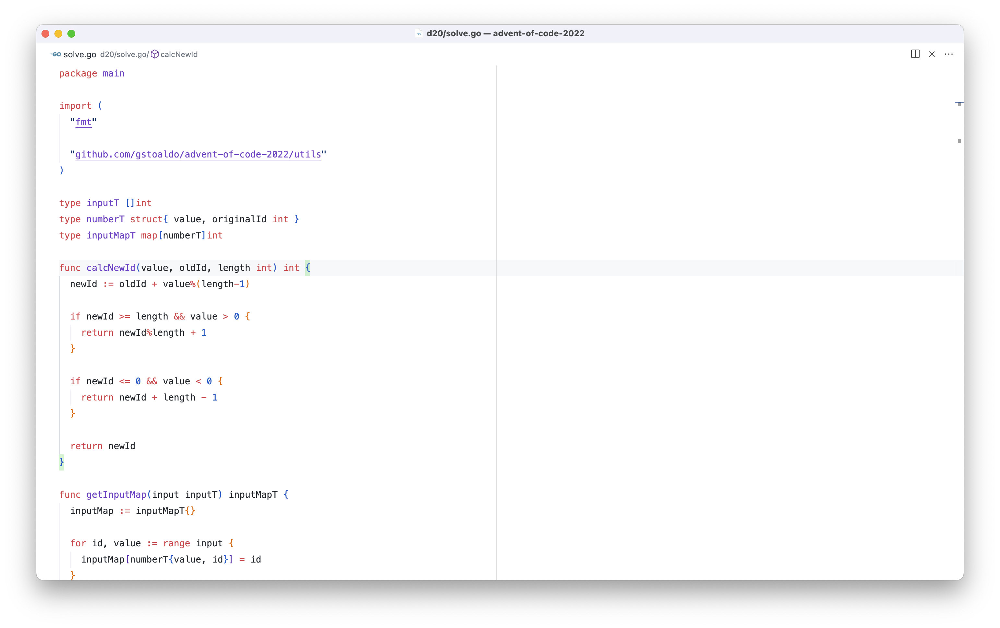

# vscode settings

[keybindings.json](keybindings.json)

[settings.json](settings.json)

[extensions.json](extensions.json)

# Reasoning behind some shortcuts

## Vertical navigation in file

I find myself reaching for the mouse when I am scanning a file looking for something. The only options to move the page vertically with the keyboard are the up/down keys, which only move 1 line at a time or the pageUp/Down, which move by a whole page.

`cmd+up/down` allows to move the cursor by N lines. Works like the `cmd+d`/`cmd+u` in Vim, which moves the cursor by 1/2 page, but I find that 1/2 page is too much, 7 lines works better for me.

Another option is the `alt+up/down` that moves the cursor to the next blank line. This is useful to select blocks of code.

## File navigation

- `cmd+p` to cycle through recently opened files
- `alt+p` to cycle through pinned files

pro tip: Hold `cmd` or `alt` and keep pressing `p` to go to the next file

I created the `alt+p` shortcut, which works like the `cmd+p` (quick open) but only shows the pinned tabs.

This command is useful when I need to edit some main files but also explore various other files. This quickly clutters the recently opened list. So, when I decide that a file is important, I pin it with `f1`, and then it will be available when I press `alt+p`.
